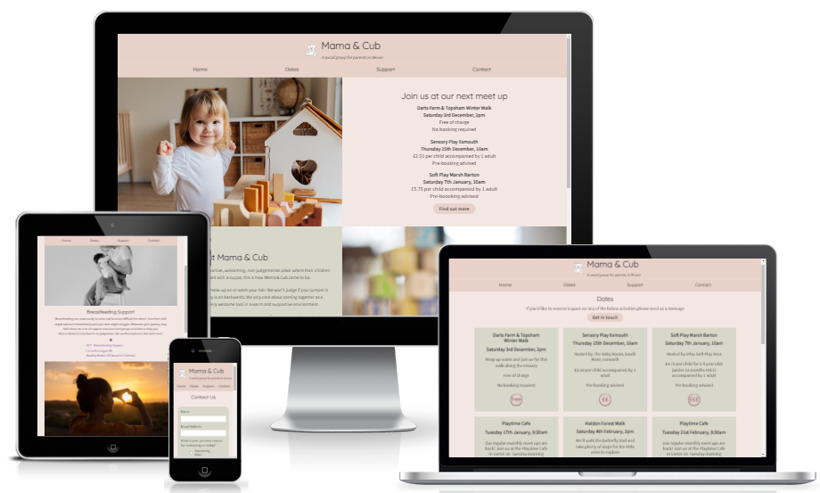

# Mama & Cub Website

Mama & Cub is a simple to use website aimed at bringing together parents and their children in the Exeter area of South Devon, UK. The site is targeted towards mums who are looking for support from their peers and community. Mama & Cub strives to make information about locations, dates, and costs easy to find for tired parents with little time.

[Visit the Muma & Cub live website here](https://llewellynksj.github.io/muma-and-cub/index.html)

 

## Contents
----

### User Experience (UX)
- Purpose
- User Stories
  - First Time Visitors
  - Returning Visitors
  - Frequent Users

### Design
- Colour Scheme
- Typography
- Imagery
- Wireframes

### Features
- Existing Features
  - Homepage
  - Dates
  - Support
  - Contact
  - Thank You
- Accessibility
- Future Features

### Technologies

### Deployment

### Testing
- Function Testing
- User Story Testing
- Lighthouse
- Validator Testing
  - HTML
  - CSS
- Bugs
  - Fixed Bugs
  - Unfixed Bugs

### Credits
- Resources
- Acknowledgements

 

----
 

## User Experience (UX)
### **Purpose**

Muma & Cub has been created as a fictional website for the purposes of completing the first milestone project as part of the Code Institute's Full Stack Software Development course. It developed as an idea from personal experience of needing a social support for parents in the local community. The needs of new parents are central to considerations around User Experience (UX) and User Interface Design (UI) and this is reflected throughout the site.

The site has been built with a mobile-first responsive design. Keeping the needs of the user at the fore-front of the design process particularly in the strategy and scope development stages. 

 

### User Stories
### **Client Goals**
- To inform visitors where and when they can join a Muma & Cub meet up
- To offer a clear and simple way to reserve places on meet ups where necessary
- To make it easy for visitors to find future meet up dates
- To easily be able to find support resources
- To be able to view on a range of device sizes

 

### **First Time Visitor Goals** 
- I want to find out when and where Muma & Cub meets
- I want to get an impression of how welcoming the group is
- I want to find out how much upcoming activities cost
- I want to easily be able to reserve a place on an upcoming activity

 

### **Returning Visitor Goals**
- I want to easily see what meet ups are coming in the future
- I want to access support resources
- I want to contact Muma & Cub if I have any questions

 

### **Frequent Visitor Goals**
- I want to be able to recommend a new meet up activity or location

 

----

