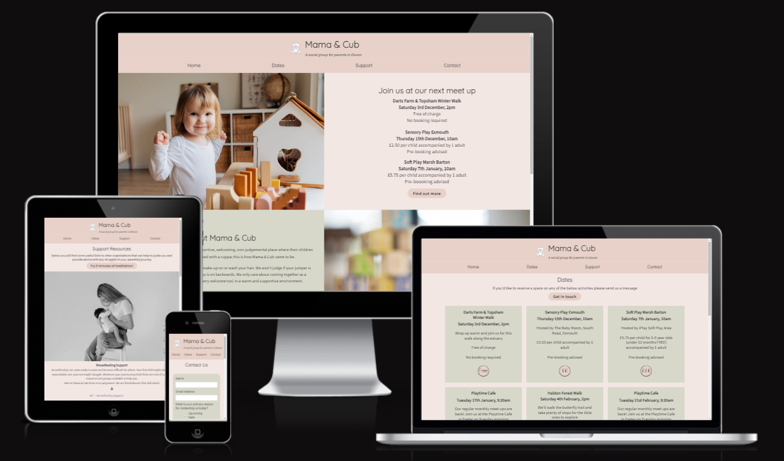

# Mama & Cub Website

Mama & Cub is a simple to use website aimed at bringing together parents and their children in the Exeter area of South Devon, UK. The site is targeted towards mums who are looking for support from their peers and community. Mama & Cub strives to make information about locations, dates, and costs easy to find for tired parents with little time.

[Visit the Muma & Cub live website here](https://llewellynksj.github.io/muma-and-cub/index.html)

 

## Contents
----

### User Experience (UX)
- Purpose
- User Stories
  - First Time Visitors
  - Returning Visitors
  - Frequent Users

### Design
- Colour Scheme
- Typography
- Imagery
- Wireframes

### Features
- Existing Features
  - Homepage
  - Dates
  - Support
  - Contact
  - Thank You
- Accessibility
- Future Features

### Technologies

### Deployment

### Testing
- Function Testing
- User Story Testing
- Lighthouse
- Validator Testing
  - HTML
  - CSS
- Bugs
  - Fixed Bugs
  - Unfixed Bugs

### Credits
- Resources
- Acknowledgements

 

----
 

## User Experience (UX)
### **Purpose**

Muma & Cub has been created as a fictional website for the purposes of completing the first milestone project as part of the Code Institute's Full Stack Software Development course. It developed as an idea out of personal experience of needing a social support group for parents in the local community. The needs of new parents are central to considerations around User Experience (UX) and User Interface Design (UI) and this is reflected throughout the site.

The site has been built with a mobile-first responsive design. Keeping the needs of the user at the forefront of the design process particularly in the strategy and scope development stages. 

New parents are likely to have little time and little energy. Therefore the focus around the design of this website has been to keep things simple, clean and calm.  

 

### User Stories
### **Client Goals**
- To inform visitors where and when they can join a Muma & Cub meet up
- To offer a clear and simple way to reserve places on meet ups where necessary
- To make it easy for visitors to find future meet up dates
- To easily be able to find support resources
- To be able to view on a range of device sizes

 

### **First Time Visitor Goals** 
- I want to find out when and where Muma & Cub meets
- I want to get an impression of how welcoming the group is
- I want to find out how much upcoming activities cost
- I want to easily be able to reserve a place on an upcoming activity

 

### **Returning Visitor Goals**
- I want to easily see what meet ups are coming in the future
- I want to access support resources
- I want to contact Muma & Cub if I have any questions

 

### **Frequent Visitor Goals**
- I want to be able to recommend a new meet up activity or location

 

----

## Design
### **Colour Scheme**
This website uses a palette of earthy colours with shades pulled from greens, pinks and browns. These embody the feel that I wanted to create for the site; natural and calming. The palette was created using the [Coolors](https://coolors.co/) website.

 

### **Typography**
[Google Fonts](https://fonts.google.com/) was used to source the font styles used throughout the website:
- Quicksand: Used for the logo and page/section headings
- Source Sans Pro: Used for main body text

These fonts were chosen to be in keeping with the style of the website; clean and simple. They were also chosen to ensure maximum accessibility.

 

### **Imagery**
Images found on the homepage, support page, and thank you page were stock photos downloaded from [Pexels](https://www.pexels.com/). They were again chosen to be in keeping with the site design with earthy natural colours.

The teddy bear logo was sourced from [Adobe Stock](https://stock.adobe.com/uk) and [Adobe JPG to Transparent PNG tool](https://www.adobe.com/express/feature/image/convert/jpg-to-png/transparent-png) was used to remove the background. 
This image was chosen as it immediately represents children, fun and play. On seeing this the user will immediately recognise that this site is for activity related to young children.

The images reflecting the cost of activities on the dates page were created by me using [Canva](https://www.canva.com/). I ensured the colours used throughout the website were also reflected in these images.

Icons used on the homepage and support page were imported through [Font Awesome](https://fontawesome.com/).

 

### **Wireframes**
To create the wireframes I used the [Balsamiq Wireframing Software](https://balsamiq.com/).

Homepage (mobile)

Homepage (desktop)

 

Dates page (mobile)

Dates page (desktop)

 

Support page (mobile)

Support page (desktop)

 

Contact page (mobile)

Contact page (desktop)

 

For a full PDF of all wireframes (mobile, tablet, desktop) click [here](documentation/wireframes/Muma%20%26%20Cub%20Wireframes.pdf).

----

## Features
### **Existing Features**
The website has 4 main pages accessible to the user which include the homepage, dates page, support page and contact page. There is also a thank you page which only shows on submission of the contact form.

**All** pages include the following features:
- Logo and tagline: The logo and tagline appear on each page clearly showing the name of the organisation that the site belongs to and what the organisation is, e.g. 'a social group for parents in Devon'. When the user scrolls down the page the logo and tagline do not remain fixed (unlike the navigation bar - see below) to ensure the maximum amount of screen space is utilised by content.

- Navigation bar: The navigation menu allows users to move through the different pages of the website. A sticky positioning has been used here so that the links to the other pages remain fixed and in sight even when scrolling; this ensures a good user experience across all devices.

- Footer: The footer contains two universally recognised icons for social media; Facebook and Instagram. These have intentionally been chosen as they are the most appropriate for the organisation, and also to keep the footer uncluttered.

### Homepage
Taking the user on a journey
- Next meet up: on mobile shows only the very next meet-up, on tablet shows the next two, on desktop shows the next 3
- About: tells the user who this group is for
- Support resources: shows the user that the group is more than just a social group
- Imagery: keeps the key information on the homepage obviously clear and seperate

 

### Dates

 

### Support

 

### Contact

 

### Thank You

 

### **Accessibility**
In addition to simply being best practice, having an accessible website is extremely high on the list of requirements for my target audience. I have paid close attention to the following in order to ensure my site is as accessible as possible:
- Clear and simple font styling, avoiding any cursive or calligraphic scripts.
- Contrasting colour scheme, but avoiding coloirs that are too bold.
- Addition of a fixed menu bar so users can easily navigate around the site
- Use of semantic HTML
- Ensuring all images have an alt description for screen readers or where the image cannot be loaded. Also ensuring that these are as descriptive as possible.

 

### **Future Features**
burger menu
booking system

 

----

## Technologies

 

----

## Deployment

 

----

## Testing
### **Function Testing**

 

### **User Story Testing**

 

### **Lighthouse**

 

### **Validator Testing**
  - HTML

   

  - CSS

   

### **Bugs**
  - Fixed Bugs

   

  - Unfixed Bug

 

----

## Credits
### **Resources**

 

### **Acknowledgements**
I would like to take a moment to acknowledge some key people who helped me in successfully putting together this website and making it something I feel worthy of as my very first coding project.

- Ronan McClelland, my Code Institute mentor, for his wise guidance and bombarding me with the best resources available online; I am so grateful
- James Llewellyn for taking the time to test every single tiny change I made to my code throughout the development process, and his invaluable opinions
- My NCT antental group for providing me with a real-life target audience testing group; Sam Landy, Sarah Turner, Christina Collins, Hess Lewis, Sabine Jary, and Katie Bennett
- [Kera Cudmore]() for all of her excellent advice on creating README documentation
- Peer code review responses