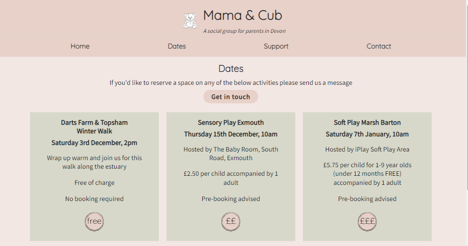
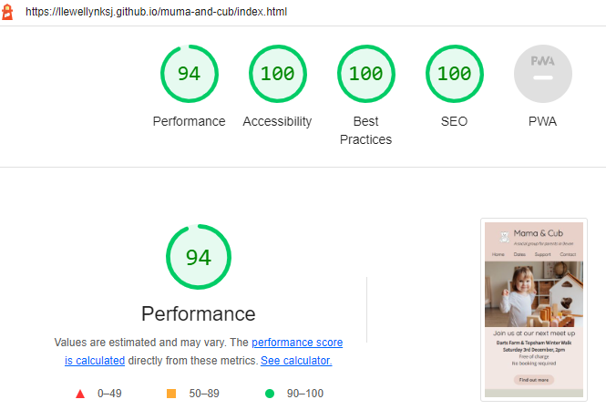

# Mama & Cub Website

Mama & Cub is a simple to use website aimed at bringing together parents and their children in the Exeter area of South Devon, UK. The site is targeted towards mums who are looking for support from their peers and community. Mama & Cub strives to make information about locations, dates, and costs easy to find for tired parents with little time.

[Visit the Muma & Cub live website here](https://llewellynksj.github.io/muma-and-cub/index.html)

 

## Contents
----

### [User Experience (UX)](#user-experience-ux-1)
- [Purpose](#purpose)
- [User Stories](#user-stories)
  - [First Time Visitors](#first-time-visitor-goals)
  - [Returning Visitors](#returning-visitor-goals)
  - [Frequent Users](#frequent-visitor-goals)

### [Design](#design-1)
- [Colour Scheme](#colour-scheme)
- [Typography](#typography)
- [Imagery](#imagery)
- [Wireframes](#wireframes)

### [Features](#features-1)
- [Existing Features](#existing-features)
  - [Homepage](#homepage)
  - [Dates](#dates)
  - [Support](#support)
  - [Contact](#contact)
  - [Thank You](#thank-you)
- [Accessibility](#accessibility)
- [Future Features](#future-features)

### [Technologies](#technologies-1)

### [Deployment](#deployment-1)

### [Testing](#testing-1)
- [Function Testing](#function-testing)
- [User Story Testing](#user-story-testing)
- [Lighthouse](#lighthouse)
- [Validator Testing](#validator-testing)
- [Bugs](#bugs)

### [Credits](#credits-1)
- [Resources](#resources)
- [Acknowledgements](#acknowledgements)

 

----

 

## User Experience (UX)
### **Purpose**

Muma & Cub has been created as a fictional website for the purposes of completing the first milestone project as part of the Code Institute's Full Stack Software Development course. It developed as an idea out of personal experience of needing a social support group for parents in the local community. The needs of new parents are central to considerations around User Experience (UX) and User Interface Design (UI) and this is reflected throughout the site.

The site has been built with a mobile-first responsive design. Keeping the needs of the user at the forefront of the design process particularly in the strategy and scope development stages. 

New parents are likely to have little time and little energy. Therefore the focus around the design of this website has been to keep things simple, clean and calm.  

 

### User Stories
### **Client Goals**
- To inform visitors where and when they can join a Muma & Cub meet up
- To offer a clear and simple way to reserve places on meet ups where necessary
- To easily be able to find support resources
- To be able to view on a range of device sizes
- Create a welcoming non-judgemental brand identity

 

### **First Time Visitor Goals** 
- I want to find out when and where Muma & Cub meets
- I want to get an impression of how welcoming the group is
- I want to find out how much upcoming activities cost
- I want to easily be able to reserve a place on an upcoming activity

 

### **Returning Visitor Goals**
- I want to easily see what meet ups are coming in the future
- I want to access support resources
- I want to contact Muma & Cub if I have any questions

 

### **Frequent Visitor Goals**
- I want to be able to recommend a new meet up activity or location

 

----

## Design
### **Colour Scheme**
This website uses a palette of earthy colours with shades pulled from greens, pinks and browns. These embody the feel that I wanted to create for the site; natural and calming. The palette was created using the [Coolors](https://coolors.co/) website.

 

### **Typography**
[Google Fonts](https://fonts.google.com/) was used to source the font styles used throughout the website:
- Quicksand: Used for the logo and page/section headings
- Source Sans Pro: Used for main body text

These fonts were chosen to be in keeping with the style of the website; clean and simple. They were also chosen to ensure maximum accessibility.

 

### **Imagery**
Images found on the homepage, support page, and thank you page were stock photos downloaded from [Pexels](https://www.pexels.com/). They were again chosen to be in keeping with the site design with earthy natural colours.

The teddy bear logo was sourced from [Adobe Stock](https://stock.adobe.com/uk) and [Adobe JPG to Transparent PNG tool](https://www.adobe.com/express/feature/image/convert/jpg-to-png/transparent-png) was used to remove the background. 
This image was chosen as it immediately represents children, fun and play. On seeing this the user will immediately recognise that this site is for activity related to young children.

The images reflecting the cost of activities on the dates page were created by me using [Canva](https://www.canva.com/). I ensured the colours used throughout the website were also reflected in these images.

Icons used on the homepage and support page were imported through [Font Awesome](https://fontawesome.com/).

 

### **Wireframes**
To create the wireframes I used the [Balsamiq Wireframing Software](https://balsamiq.com/).

Homepage (mobile)

Homepage (desktop)

 

Dates page (mobile)

Dates page (desktop)

 

Support page (mobile)

Support page (desktop)

 

Contact page (mobile)

Contact page (desktop)

 

For a full PDF of all wireframes (mobile, tablet, desktop) click [here](documentation/wireframes/Muma%20%26%20Cub%20Wireframes.pdf).

----

## Features
### **Existing Features**
The website has 4 main pages accessible to the user which include the homepage, dates page, support page and contact page. There is also a thank you page which only shows on submission of the contact form.

**All** pages include the following features:
- Logo and tagline: The logo and tagline appear on each page clearly showing the name of the organisation that the site belongs to and what the organisation is, e.g. 'a social group for parents in Devon'. When the user scrolls down the page the logo and tagline do not remain fixed (unlike the navigation bar - see below) to ensure the maximum amount of screen space is utilised by content.

- Navigation bar: The navigation menu allows users to move through the different pages of the website. A sticky positioning has been used here so that the links to the other pages remain fixed and in sight even when scrolling; this ensures a good user experience across all devices.

- Footer: The footer contains two universally recognised icons for social media; Facebook and Instagram. These have intentionally been chosen as they are the most appropriate for the organisation, and also to keep the footer uncluttered.

 

### Homepage
The homepage is split into three sections. These sections take the user on a clear journey as to what to expect from the website. 

Each section has relevant imagery that both indicates that the website is related to young children/parents, and that clearly seperates the information into format that flows.

At the end of each section of text there is a call to action button allowing the user to link to another place or page on the website related to that specific piece of text.

- Top section: The central element that appears here shows information regarding the next meet up date, time and location. This is responsive across devices so will show 1 upcoming date on mobile and tablet screens, 2 upcoming dates on laptop screens, and 3 upcoming dates on desktop.

- Middle section: This informs the user as to what the organisation does and who it is for. Again this is styled to be responsive with a shorter summary of text for mobile, tablet and laptop screen sizes, whilst on larger desktop size screens slightly more information is visible. This has been done to keep the 'About us' section from appearing verbose while also managing white space on larger screens.

- Lower section: The lower section shows the user that the organisation is more than just a social group but also a community *support* group. Icons have been used here to make the list of types of support more visually appealing.

 

### Dates
The dates page consists of:
- A simple layout of boxes that form a grid. Each location, date and time is in bold as this is likely to be the information user will want to be able to see quickly and be able to pick up with glance when they scroll through the page.

- An image of a cost range has been added to each upcoming activity so that users are able to quickly assess if the activity is within their budget.

- Call to action buttons appear at the top and bottom of the page.

 

### Support
The support page consists of:
- A call to action button at the top of the page takes the user to the end of this page to view an embedded YouTube video of a short meditation exercise.

- Like the homepage this page is split into three seperate sections. Each section provides the user with a heading, summary and then a number of links to external sites. Each link opens in a new tab for a good user experience.

- At the end of the page a YouTube video is embedded. The video links well with the lower section of this page regarding mindfulness and wellbeing. The video is also set so as not to autoplay.

 

### Contact
This page consists of:
- A form: The form allows the user to contact the organisation with their basic details. It offers a choice of primary reasons for their contact, and allows an area for a free text message.

- Contact information: Each different method of contact is shown with a corresponding icon for easy recognition.

- Google Maps: A google map of the Exeter area is included

 

### Thank You
This page consists of:
- A thank you message confirming to the user that their message has been submitted and that someone will be in touch with them soon.
- An image of a little girl using a mobile phone

 

### **Accessibility**
In addition to simply being best practice, having an accessible website is extremely high on the list of requirements for my target audience. I have paid close attention to the following in order to ensure my site is as accessible as possible:
- Clear and simple font styling, avoiding any cursive or calligraphic scripts.
- Contrasting colour scheme, but avoiding coloirs that are too bold.
- Addition of a fixed menu bar so users can easily navigate around the site
- Use of semantic HTML
- Ensuring all images have an alt description for screen readers or where the image cannot be loaded. Also ensuring that these are as descriptive as possible.

 

### **Future Features**
In the future there are features and developments I would like to consider adding to create an even better user experience of this website. They include:

- Use javascript to create a hamburger menu for the navigation bar on smaller devices. I am aware that a burger menu can be created using just HTML and CSS but I felt the process was taking too long for me to learn and implement for this project.
- Add a filter tool on the dates page for users to filter activities by certain criteria such as cost, location, or date.
- Add a booking system so that users could reserve spaces on activities or even pay for certain activities in advance.
- Look at refining the use of space on the Contact page particularly in relation to laptop and larger devices. I believe there could be more balance or better use of white space.

 

----

## Technologies
### **Languages Used**
This website has been written in HTML and CSS only.

 

**Frameworks, Libraries and Programs Used**
- Github: Storing and hosting my code/repositories
- Gitpod: Code editor for writing my code and storing other images/files
- Font Awesome: For icons used throughout the site
- Google Fonts: To import the fonts used throughout the site
- Coolors: Colour palette picking website used to choose my colour scheme
- Pexels: Stock images
- Google DevTools: Used throughout the site's creation to test responsiveness and tweak layout
- Balsamiq: Wireframe software
- Favicon.io: To create favicon
- Am I Responsive: To create a visual of the website across different device sizes
- [BIRME](https://www.birme.net/?) To resize images
- [ezgif.com](https://ezgif.com/png-to-webp) To convert images to webp files
- [Gyazo](https://gyazo.com/) To create GIFs to use in the README

 

----

## Version Control
Version control has been maintained using Git. The code written for this website has been updated via regular commits to Github. These serve as a record of development and changes to the varying pages of html and css.

My commit history can be viewed [here](https://github.com/llewellynksj/muma-and-cub/commits/main)

 

----

## Deployment
Github was used to deploy the website. The steps below were followed in order to achieve this:

1. Log in to Github account
2. Navigate to the project repository
3. Click the 'Settings' button near the top of the page
4. Click the 'Pages' button from the left-hand menu
5. The 'Source' box should state 'Deploy from a branch'
6. Under the 'Branch' box click to select 'main'

7. Click 'Save'
8. It may take a few minutes to refresh but you will then be able to see the project has been made live

 

----

## Testing
Testing was performed across a range of devices, including:
- HP Elitebook 840 GS (1920 x 1080)
- HP Monitor (2560 x 1440)
- Surface Pro 6 (1368 x 912)
- iPhone 13 mini

### **Function Testing**

| Page | Test | Successfully Completed |
| :----| :---| :----------------------:|
| All  | Logo text links back to homepage | Yes |
| All  | Navigation links go to relevant page | Yes |
| All  | Navigation menu remains fixed at top of page on scroll | Yes |
| All  | Social media icons in footer link to external sites, opening in new tabs | Yes
| All  | Call to action buttons link to relevant page | Yes |
| All  | External links open to correct page and in a new tab | Yes |
| Homepage | Images and text flex responsively | Yes |
| Dates  | Grid is responsive | Yes |
| Support  | Images and text flex responsively | Yes |
| Support  | Embedded YouTube video is responsive | Yes |
| Contact  | Required elements are active on the form | Yes |
| Contact  | Submit button directs to thank you page | Yes |
| Contact  | Email, Phone and Facebook Messenger contact links open in the relevant systems | Yes |

 

### **User Story Testing**

| Client Goal | Solution | Tested & Successfully Completed |
| :----| :---| :----------------------:|
| To inform visitors where and when they can join a Muma & Cub meet up  | Immediately visible on homepage with call to action button directing to dates page with further information. | Yes |
| To offer a clear and simple way to reserve places on meet ups where necessary.  | Each upcoming activity box states if booking is required, and a statement and button at the top of the dates page advises to get in touch to reserve spaces. | Yes |
| To easily be able to find support resources | Visible at the bottom of the homepage, and via the dedicated Support page. | Yes
| To be able to view on a range of device sizes  | Responsive design means style is kept intact across different devices. | Yes |
| Create a welcoming non-judgemental brand identity | Reinforced through colour scheme, font style, language used and imagery. | Yes|

 

| First Time Visitor Goal | Solution | Tested & Successfully Completed |
| :----| :---| :----------------------:|
| I want to find out when and where Muma & Cub meets  | Immediately visible on homepage with call to action button directing to dates page with further information. | Yes |
| I want to get an impression of how welcoming the group is  | Emphasis is given to this through language used in the 'About us' section of the homepage. Also through use of colour scheme, fonts and imagery. | Yes |
| I want to find out how much upcoming activities cost | Each upcoming activity states the exact cost, but a price range is indicated with an image of 'Free/£/££/£££' on the Dates page. | Yes
| I want to easily be able to reserve a place on an upcoming activity  | The method of doing this is stated at the very start of the Dates page as well as appearing as an option for contact reason on the form. | Yes |

 

| Returning Visitor Goal | Solution | Tested & Successfully Completed |
| :----| :---| :----------------------:|
| I want to easily see what meet ups are coming in the future | Immediately visible on homepage with call to action button directing to dates page with further information. | Yes |
| I want to access support resources  | Visible at the bottom of the homepage, and via the dedicated Support page. | Yes |
| I want to contact Muma & Cub if I have any questions | The Contact page provides a form for contacting Muma & Cub. Other ways of contacting are also given including direct email address, phone number and Facebook Messenger. | Yes

 

| Frequent Visitor Goal | Solution | Tested & Successfully Completed |
| :----| :---| :----------------------:|
| I want to be able to recommend a new meet up activity or location | This is possible via the contact Form. | Yes |

 

### **Lighthouse**
Some bugs were found when running Lighthouse testing. These are listed in the [Bugs](#bugs) section.

For Mobile Devices

Homepage

Dates Page

Support Page

Contact Page

Thank you Page

 

For Desktop

Homepage

Dates Page

Support Page

Contact Page

Thank you Page

 

### **Validator Testing**
HTML

Homepage

Dates Page

Support Page

Contact Page

I have chosen not to fix the error received regarding the height and width of the embedded Google Maps in HTML. This is a decision taken following a suggestion from a resource ([Codefoxx](https://www.youtube.com/watch?v=825ZZcArSWY)) on assigning a 100% width and height in HTML and altering the container size for the map in CSS.

Thank you Page

   

  CSS
  

Stylesheet

   

### **Bugs**
  
  | Raised by | Bug | Solution |
  | :---      | :---| :---     |
  | Lighthouse | Performance was low due to images | Resized and converted images to webp files |
  | Lighthouse | Links on Support page too close together for ease of use on mobile devices | Padding added to create more spacing |
  | Lighthouse | Radio buttons on Contact page form too close small for ease of use on mobile devices | Size increased |
  | WC3 Validator | Duplicate 'title' attribute in iframe on Support page | Duplicate removed |
  | WC3 Validator | Obsolete 'frameborder' attribute in iframe on Support page | Obsolete attribute removed |
  | WC3 Validator | Font Awesome icons on homepage not nested in a list attribute and the icon cannot be a child of the unordered list attribute | Nest the icons in a list attribute |
  | Target user tester | Images on Support page not clear which heading they belong to when scrolling on mobile | Move images on support page to appear directly above the text they relate to for better flow on mobile devices |
  | Target user tester | When hovering on upcoming dates information the hover feature was causing lines of text to drop to another line on certain size screens | Changed the grid columns from having a min/max of '340, 1fr' to '340, 340' so that the size of the boxes do not change on different screen sizes ensuring the text remains fixed |

 

----

## Credits
### **Resources**
- [Code Institute]() HTML and CSS learning content and for providing the [template]() used to start this website
- [Scrimba](https://scrimba.com/) - [CSS Grid Tutorial](https://scrimba.com/learn/cssgrid) and [CSS Flexbox Tutorial](https://scrimba.com/learn/flexbox)
- [W3Schools](https://www.w3schools.com/) For general tips and advice on a variety of HTML and CSS
- [CSS-Tricks](https://css-tricks.com/) - [A Complete Guide to Grid](https://css-tricks.com/snippets/css/complete-guide-grid/) and [A Complete Guide to Flexbox](https://css-tricks.com/snippets/css/a-guide-to-flexbox/)
- [The Forgotten CSS Position](https://www.youtube.com/watch?v=NzjU1GmKosQ) YouTube video by [Web Dev Simplified](https://www.youtube.com/c/WebDevSimplified) 
- [Embed a YouTube Video in HTML and Make it Responsive](https://www.youtube.com/watch?v=9YffrCViTVk) YouTube video by [tipswithpunch](https://www.youtube.com/c/tipswithpunch)
- [HTML & CSS - How to Embed a Google Map in your Website](https://www.youtube.com/watch?v=825ZZcArSWY) Youtube video by [Codefoxx](https://www.youtube.com/c/codefoxx)
- [Handbook Markdown Guide](https://about.gitlab.com/handbook/markdown-guide/) Guidance on using markdown
- README guides by [Kera Cudmore](https://github.com/kera-cudmore) - [Creating your First README](https://github.com/kera-cudmore/readme-examples) and [README Examples - Milestone 1](https://github.com/kera-cudmore/readme-examples/blob/main/milestone1-readme.md)

 

### **Acknowledgements**
I would like to take a moment to acknowledge some key people who helped me in successfully putting together this website and making it something I feel worthy of as my very first coding project.

- Ronan McClelland, my Code Institute mentor, for his wise guidance and bombarding me with the best resources available online; I am so grateful
- James Llewellyn for taking the time to test every single tiny change I made to my code throughout the development process, and his invaluable opinions
- My NCT antental group for providing me with a real-life target audience testing group; Sam Landy, Sarah Turner, Christina Collins, Hess Lewis, Sabine Jary, and Katie Bennett
- [Kera Cudmore]() for all of her excellent advice on creating README documentation